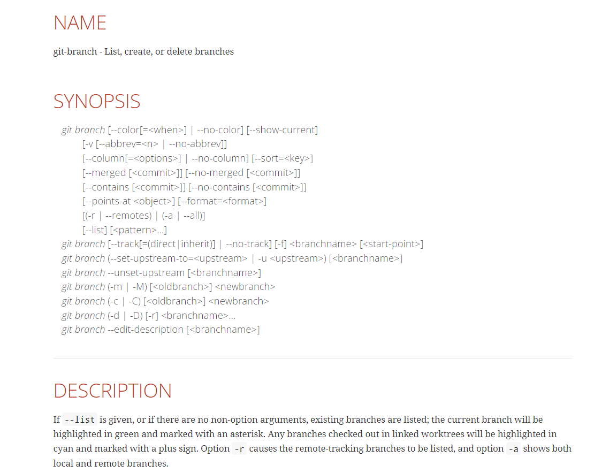

```{r setup, include = FALSE}
knitr::opts_chunk$set(
  collapse = TRUE,
  comment = "#>",
  echo = TRUE)
```

Git.. GitHub.. What are they? Why do they matter? In this tutorial we will introduce you to Git and GitHub. This presentation is for individuals with limited knowledge on Git and GitHub, although those with robust knowledge or background are more than welcome to join! 

# Learning Objectives
1. Describe Git and Graphical User Interfaces
1. Set up and connect Git, GitHub and RStudio
1. Create your own profile repository on GitHub
1. Practice navigating how to fork, commit, and request a pull Github

# Git
## What is Git?
Have you ever tried working on a project or a specific piece of code with a colleague but could not figure out what changes they made? Or have you ever overwritten your code and had to rewrite the chunk from the beginning?

Frustrating, right? Well, Git is a version control that allows you to do better. Be a better coder, communicator and person because the time you will save can then be spent elsewhere!

Now, I will preface by saying that there is a learning curve to Git. But keep at it, take breaks, and do not ignore your mental health.

## Set Up

Let's get started shall we! 

First, check to see if you already have Git installed. On Windows, look for an application called "Git Bash" and on Macs, search for an application called "Terminal." Type "git version" into the terminal. If you have an output with the version, Git is installed, if the terminal is saying unknown command, then Git it not installed. 

If you do not already have Git installed, navigate to [Git](https://git-scm.com/) and click *Downloads.* Select the software appropriate for your system and follow the remaining installation steps.

**Windows**

1. Select **"Click here to download"** This should be the version you need however, you can look below to see additional options.
1. Allow installer to download then open.
1. "Do you want to allow this app to make changes to this device?" Yes, yes you do! You will need administrative access to your computer for this.
1. Use the defaults throughout the installation process.

**Mac**

If you have Git installed, then we will most likely just need to update it. 

To Update Git
1. Follow this [video](https://modulesunraveled.com/installing-git/updating-git-if-you-have-only-version-comes-xcode-or-command-line-developer-tools)!

To Install Git
1. Select **"Click here to download"** This should be the version you need however, you can look below to see additional options.
1. Click on the Binary installer link and select download.
1. Once it is downloaded, open the file, locate the package, right click and select "Open"
1. Follow the prompts
1. For help with the remaining installation process, follow this 
[video](https://modulesunraveled.com/installing-git/installing-git-if-you-do-not-have-xcode-or-command-line-developer-tools-installed)

##Git Configuration Basics
When you configure git you will have options on what level you would like to make configurations.

  *System Level*
  git config --system
  
  *User Level*
  git config --global
  
  *Project Level*
  git config

Let's set up some basic git configurations. 
1. Setting up your username: When you set your user name, this will have everything you do in git have your user name associated with it.
  config --global user.name "Michelle Slawinski"
  
1. Setting up your email: Do the same thing with your email address. This should be the email you used to set up your GitHub account.
  config --global user.email "my_email.com"
  
1. Viewing git configurations: Type this code and scroll to the bottom to see the configurations you set up.
  git config --list

For other configuration options see [here](https://git-scm.com/docs/git-config)

Are you Stuck? Ask Git!
In the terminal, type "git help" and it will return some common Git commands. If you want to learn more about a specific command such as branching, you can type "git help branch" and it will pull up a manual on branching.



## Git Resources
* [Pro Git Book](https://git-scm.com/book/en/v2)
* [Git Reference Guides](https://git-scm.com/docs)
* [Git Guides](https://github.com/git-guides/install-git)
* [LinkedIn Learning Git Essential Training: The Basics](https://www.linkedin.com/learning-login/share?account=42166124&forceAccount=false&redirect=https%3A%2F%2Fwww.linkedin.com%2Flearning%2Fgit-essential-training-the-basics%3Ftrk%3Dshare_ent_url%26shareId%3DSxKxywffQ8iDu%252FzDfk84uw%253D%253D)

# Graphical User Interface (GUI)
## What are GUIs?
Git but better. GUIs are where you can use Git but in a more visually pleasing manner. Instead of using command lines in Git, you can use a click-based GUI. Think of it like using R/SAS versus SPSS or Jasp. 

**Popular GUIs**
Microsoft       | Mac            
---------       | ----------     
*GitHub Desktop | *GitHub Desktop 
*GitKraken      | *GitKraken
*Sourcetree     | *Sourcetree
*TortoiseGit    | *Fork
*SmartGit       | 

# GitHub
## What is GitHub?
Git and GitHub are essentially the same thing but GitHub makes it easier on us as human beings. GitHub is a cloud based management tool for your code. Think of it like Microsoft Word's tracked changes feature. In a Word document, you can use this feature to *visualize* the changes you or someone else are making. In GitHub, we are using a similar way to visualize version control. This is extremely important when you start working in teams or on a large project. You will want to have changes to your code saved so that you can refer back if you need to.  

## Setup
Navigate [here](https://desktop.github.com) to download GitHub Desktop and follow prompts. You will want to create an account and hold on to the email you use for this account.

Now that you have an understanding of Git and GUIs such as GitHub, let's practice!

We will be practicing how to fork a repository from GitHub, make a change locally, then commit those changes and push them back to GitHub. Ready? Lets get our feet wet. 

1. Navigate to [RLadies of Gainesville's GitHub](https://github.com/R-Ladies-Gainesville) 
1. Locate and click on the "practice" repository  
1. In the upper right hand corner, click "Fork" 
Once you have it forked, you will see that it is in your remote GitHub. Now that you have it remotely, we will want to get access to it locally so that we can add to the repository. 
1. Click into the 'practice' repository if you are not already in it and click on the 'Code" dropdown.
1. Select Open with GitHub Desktop. Once you click this, GitHub Desktop should open with a screen asking you where you would like to place the repository on your desktop. Go ahead and find where you would like to put the repository. 

## GUI Resources
* [GUI Clients](https://git-scm.com/downloads/guis)

#Additional Learning in R
# RStudio
## Setup

**Checking Your Current Version of R**
```{r}
R.version.string
```

**Introducing Yourself to Git**
```{r}
#install if needed:
#install.packages("usethis")

library(usethis)
use_git_config(user.name = "#insert your first and last name#", user.email = "#insert your email#") 
  #use.email should be the same as your GitHub account
```

**Setting up a token in RStudio**
```{r}
usethis::create_github_token()
gitcreds::gitcreds_set
```

## RStudio Resources
*[An Introduction to Git and how to use it with RStudio](https://r-bio.github.io/intro-git-rstudio/)

#Last Minute Things
## Dictionary
Term           | Definition
---------      | ----------
Shell          | A terminal that uses written commands to interact with your operating system
Git Directory  | Umbrella terms for all of your files and folders
Modify         | Changed the file but have not committed it to your local system
Staged/Indexed | Marked a modified file to go into your next commit snapshot
Commit         | Save the state of your project in your local system
Branch         | When you duplicate part of a repository
Merge          | After you finish updating the code you branched, you can merge it back into the project's main source code
Push           | Once you commit your project or file to your local system, you have the option to push it to remote GitHub
Pull           | If your repository has new changes in GitHub, you can download and integrate those remote changes by using 'pull' 
Fetch          | To see if there are remote changes, you can use fetch to see what was updated. Fetch will not merge your updates though

##Tips
1. Update some basic profile features GitHub offers like a picture, occupation, or location! Click your picture in the top right corner after logging in and select 'Settings.' 
1. You can also personalize your profile's ReadMe file with an introduction for people who will visit your page. This is again optional but helps you get noticed. If you want to see some super cool examples, beef up your profile with certain tools, or do some  late night reading on how to make your profile stand out, look at this [repository](https://github.com/abhisheknaiidu/awesome-github-profile-readme)!
1. Make sure you have a ReadMe file for every repository. This serves as an executive summary for your project and saves viewers time on figuring out what the purpose of your project is.
1. When you make a commit, make sure you are descriptive, especially if you are working on a team. You can use git to search your commit messages so you'll want to be descriptive! Google 'git commit best practices' and you can look through all the suggestions on how to do this.
1. Branch this markdown file and add your own tips!

& that's it! 

# Sharing your tutorial
## Slides
If you're sharing your tutorial at an R-Ladies meeting, consider making slides to go along with it.

See the [R-Ladies Gainesville presentations repository](https://github.com/R-Ladies-Gainesville/presentations) to download the the R Markdown file `tutorial_template.Rmd`. The tutorial_template presentation is created with the [xaringan](https://slides.yihui.org/xaringan/#1) package and the RLadies theme by [Alison Hill](https://www.apreshill.com/project/rladies-xaringan/).

## Github
Now it's time to add your tutorial to the R-Ladies Gainesville [tutorials repository](https://github.com/R-Ladies-Gainesville/tutorials). This will make it easier for others to provide feedback and for people to use your tutorial!
